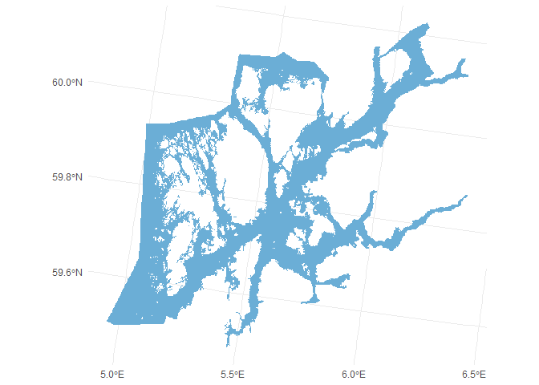
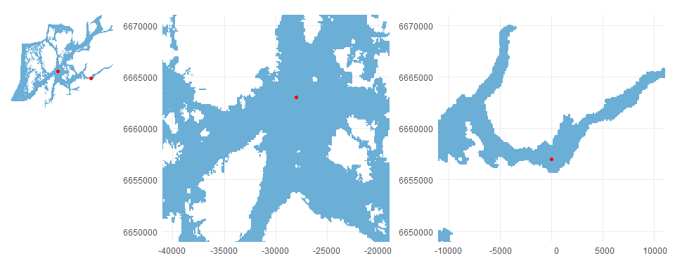
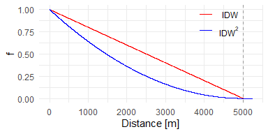
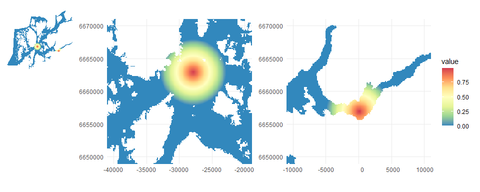

example_effect_distances.R
================
Ciaran Murray
2025-01-24

### Read the raster for study area.

This is the modified raster for the study area with value equal to 1.0
in all water cells. Land cells have NA values. The water (non-NA) cells
are also limited to the area defined by the “vannområde”.

The raster was generated from land polygons and then “manually” edited.
That is, grid cells classified as land which really should be water were
manually identified and reclassified. Conversely some grid cells
classified as land were changed to land.

``` r
folder <- "C:/Users/CJM/OneDrive - NIVA/_repositories/METOMILO/grid_v3/raster/"
file_r <- "Sunnhordaland_5109_02.tif"

r <- terra::rast(paste0(folder, file_r))

ggplot() +
  geom_spatraster(data=r) +
  coord_sf(datum =sf::st_crs(r), xlim=c(-10000,10000), ylim=c(6650000,6670000)) +
  scale_fill_distiller(palette = 1, na.value = "transparent", guide="none") +
  coord_sf() +
  theme_minimal()
```

    ## <SpatRaster> resampled to 500566 cells for plotting
    ## Coordinate system already present. Adding new coordinate system, which will
    ## replace the existing one.

<!-- -->

### Define example point data

Here we generate an example of point data with two separate points.
These points represent the source of a pressure. The intensity of the
pressure at the source points is 1.0

We will define a function to calculate the intensity of the pressure at
grid cells around the pressure source.

``` r
effect_dist <- 5000 # meters

df <- data.frame(x_source=c(-28000, 0), y_source=c(6663000,6657000))

# add a value 
df <- df %>%
  mutate(source_value=1)

df$id_source <- 1:nrow(df)

# convert the source points to spatial data
pts <- sf::st_as_sf(df, coords = c("x_source","y_source"), crs=sf::st_crs(r), remove = F)
```

*reading real* point data It is more likely that you are reading the
point data from a shape file or geodatabase. In that case, instead of
using the code above, you would use `sf::st_read()`

This figure shows the location of the example points.

<!-- -->

### Define effect distance

The extent of the effect of the pressure from a source is defined by
specifying an *effect distance* in meters.

``` r
effect_dist <- 5000 # meters
```

### Calculate distances

The pressure intensity in each raster cell will be calculated as a
function of its distance from the source of the pressure.

If the distance from a source exceeds the effect distance `effect_dist`
(*5000 m*) then the value will be set to zero.

``` r
# get the coordinates of the centre points of the raster grid cells
rpts_all <- r %>% 
  terra::xyFromCell(1:terra::ncell(r)) %>%
  as.data.frame()

# add the values of the grid cells
rvalues <- terra::values(r, na.rm=F, mat=F)
rpts_all$val <- rvalues

# add an id column - we will use this later to add 
# calculated pressure values back to the raster
rpts_all$id_rast <- 1:length(rvalues)

# filter the data to exclude NA cells (not water)
rpts <- rpts_all %>%
  filter(!is.na(val))


# add an id to identify the rows in the filtered raster cells
rpts$id_filtered <- 1:nrow(rpts)

# convert to spatial data
rpts <- rpts %>%
  sf::st_as_sf(coords = c("x","y"), crs=sf::st_crs(r), remove=F)


# check which points in rpts are within the effect distance from the source points 
# this result has the same number of rows as rpts and 1 column for each source point
# (in this case 2 columns)
df_dist <- sf::st_is_within_distance(rpts, pts, dist=effect_dist, sparse=F) %>%
  as.data.frame()

nc <- ncol(df_dist)

df_dist$id_filtered <- 1:nrow(df_dist)

df_dist <- df_dist %>%
  pivot_longer(cols=all_of(1:nc), names_to = "id_source", names_prefix = "V", values_to = "value", names_transform = as.integer)

df_dist <- df_dist %>%
  filter(value==TRUE) %>%
  select(-value) 

# now we have all grid cells in r which are within a distance of effect_dist 
# from a source point

rpts <- rpts %>%
  sf::st_drop_geometry()


rpts <- rpts %>%
  left_join(df_dist, by="id_filtered")

rpts <- rpts %>%
  left_join(pts %>% sf::st_drop_geometry(), by="id_source")

# calculate the distance as RMS of distances in x and y directions
rpts <- rpts %>%
  mutate(dist=sqrt((x_source - x)^2 + (y_source - y)^2)) 
```

### Decay methods

Now we calculate a factor `f` which gives the intensity at the
calculated distance. This factor varies from *1.0* at the source point
to *0.0* where the distance is greater than the effect distance
`effect_dist`.

We can use different functions to estimate the *decay*. For example an
*inverse distance weighted* function (IDW) ${1 - \frac 1 {distance} }$
or *inverse distance squared weighted* (
${({1 - \frac 1 {distance})}^2 }$).

<!-- -->

### Calculate factors

Here we will use IDW: ${1 - \frac 1 {distance} }$. Unless you have
information about a decay function which applies to a specific pressure
source, then just use this function.

``` r
rpts <- rpts %>%
  mutate(f = 1-(dist/(effect_dist+1))) %>%
  mutate(value = source_value * f)

rpts <- rpts %>% 
  mutate(value = ifelse(is.na(value),0,value))

# we now have one row for each combination of raster cell and point source 
# (where they are within the distance limit)
# it is possible that a grid cell is within the effect range of more than one
# pressure source. The contributions from different sources should be summed

rpts <- rpts %>%
  group_by(id_rast) %>%
  summarise(value = sum(value,na.rm=T), .groups="drop")

rpts_all <- rpts_all %>%
  left_join(rpts, by="id_rast")

rp <- r
terra::values(rp) <- rpts_all$value


terra::writeRaster(rp, filename = "example_effect_distances.tif", overwrite=T)
```

### Plot the results

<!-- -->
